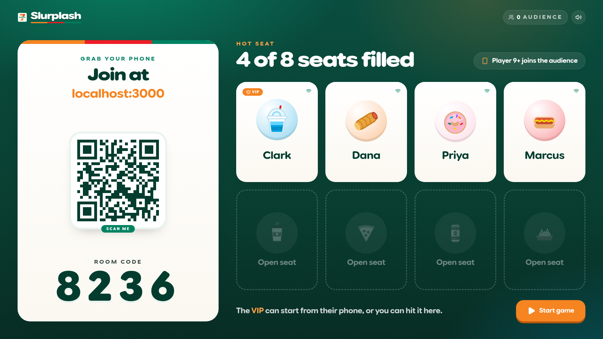
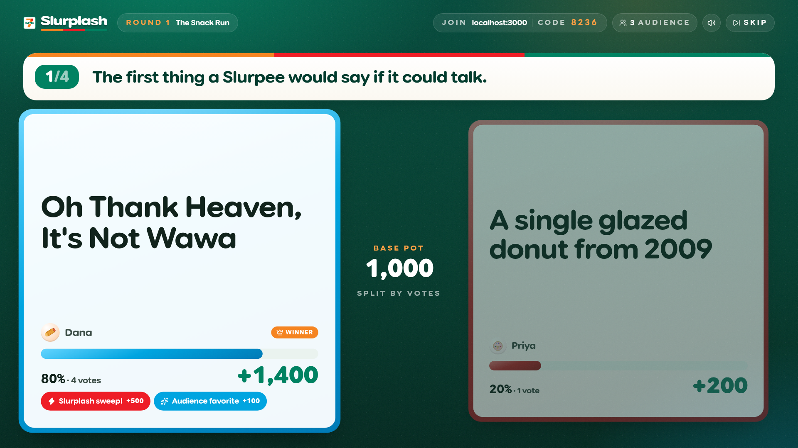
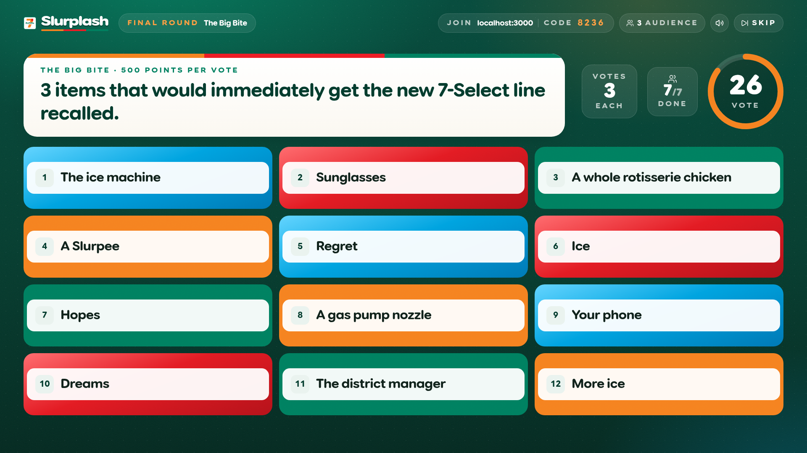
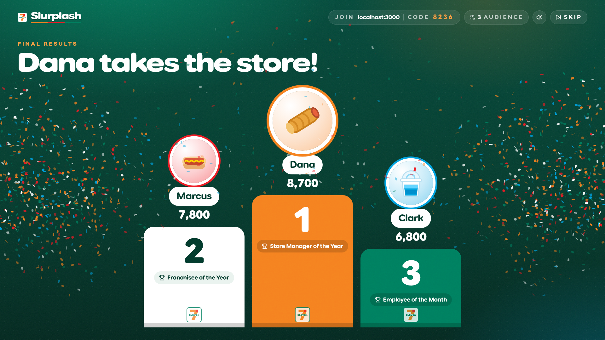
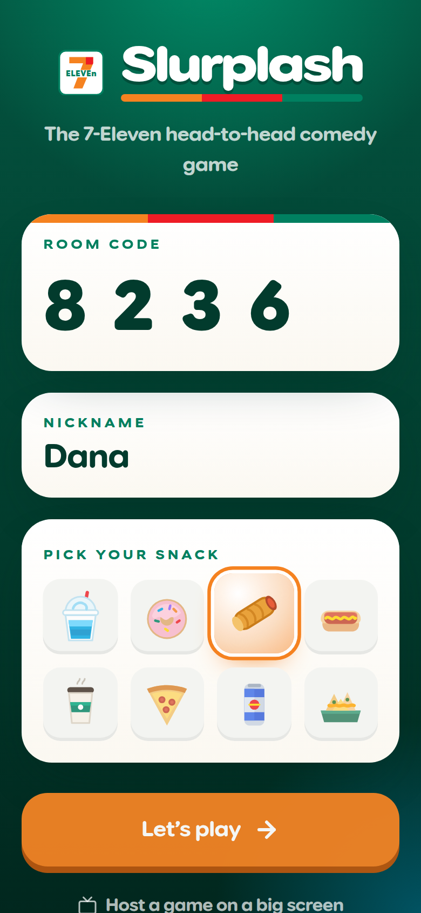
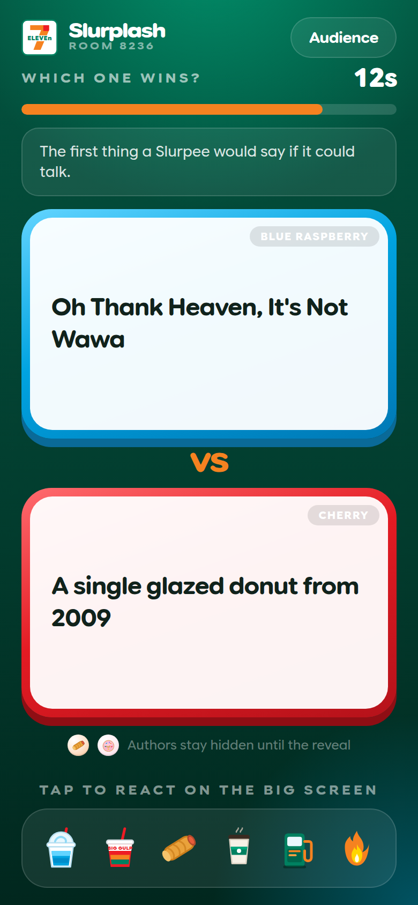

<p align="center">
  
</p>

<h1 align="center">Slurplash</h1>
<p align="center"><strong>The 7-Eleven head-to-head comedy game.</strong><br/>A Quiplash-style party game: one big screen hosts, everyone plays from their phone. Oh thank heaven.</p>

---

## Screens

| Showdown tally | The Big Bite |
| --- | --- |
|  |  |

| Podium | Phone: join | Phone: vote |
| --- | --- | --- |
|  |  |  |

## What it is

- **Big screen host** (`/host`) — a 16:9 stage for the projector or TV: lobby with QR code + 4-digit room code, round intros on the roller grill, Slurpee-splash answer reveals, live vote counts, tally animations, standings, The Big Bite, and a confetti podium with 7-Eleven trophies.
- **Phone controllers** (`/` or `/play`) — join with a code, nickname, and snack avatar. Players answer prompts and vote; everyone past the 8-player cap (or who joins mid-game) becomes **audience** and votes on every matchup, plus fires floating snack reactions onto the big screen.
- **Realtime** — a single Node process runs Next.js and a WebSocket server. Room state, timers, matchmaking, and scoring are all authoritative on the server. Phones reconnect to their seat after a refresh or a sleep.

## Quick start

```bash
npm install
npm run dev        # http://localhost:3000
```

1. Open **http://localhost:3000/host** on the big screen. It creates a room and shows the code + QR.
2. Phones open **http://localhost:3000** (or scan the QR), enter the code, pick a snack, join.
3. The first player is the **VIP** and can start from their phone. The host screen has a Start button too.

> Phones on the same Wi-Fi need your machine's LAN address, e.g. `http://192.168.1.20:3000`. The host screen prints whatever host it was opened from, so open the host page via that address and the QR just works.

## How a game plays

| Phase | What happens |
| --- | --- |
| **Round 1 · The Snack Run** | Each player gets 2 prompts (75s). Prompts are paired with the circular pairing formula so every player faces two different neighbours. Each matchup: prompt (5s) → Slurpee-splash reveal → 15s vote → tally. 1,000 base points split by vote share, **+500 Slurplash Sweep** for 100% of active-player votes, **+100 Audience Favorite**. |
| **Round 2 · Big Gulp Stakes** | Same mechanics, everything doubled (2,000 / +1,000 / +200). |
| **Round 3 · The Big Bite** | One universal prompt, 3 answers each (90s). All answers hit the screen shuffled. Every voter (players and audience) gets 3 votes. **500 points per vote.** |
| **Podium** | 3rd → 2nd → 1st revealed with trophies (Employee of the Month, Franchisee of the Year, Store Manager of the Year), then stats: Most Slurpee Sweeps, Audience Darling, Coldest Answer. Play again with the same crew, or start a new game. |

The host can hit **Skip** at any point to keep the room moving. Timers close early once everyone has answered or voted.

## Scripts

| Script | What it does |
| --- | --- |
| `npm run dev` | Next.js (Turbopack) + WebSocket server on port 3000 |
| `npm run build` / `npm start` | Production build, then the same combined server |
| `npm test` | Engine unit tests (pairing, scoring, codes) |
| `npm run typecheck` / `npm run lint` | Strict TypeScript and the Next.js ESLint config (React Compiler rules included) |
| `npm run tour` | Playwright plays a full game with a host, four players, and an audience, and writes screenshots to `./shots` (needs `npm run dev` running) |

## Architecture

```
server/
  index.ts     Node http server: Next.js request handler + `ws` upgrade on /ws
  room.ts      Room state machine (lobby → rounds → showdown → big bite → podium), timers, snapshots
  engine.ts    Pure helpers: circular pairing, matchup scoring, shuffling, room codes
src/shared/    Types + protocol, prompt bank, avatars, tuning constants (timings, points)
src/lib/       Socket client hook, Web Audio SFX synth, session persistence
src/components/
  brand/       7-Eleven tile logo, Slurplash wordmark
  icons/       Hand-drawn SVG snack avatars + reactions
  ui/          Design-system pieces: Button, Avatar, TimerRing, AnswerCard, AnimatedNumber, Stage, RollerGrill, SlurpeeSplash, FloatingReactions
  host/        Big-screen views per phase
  play/        Phone controller views per phase
```

**Protocol.** Clients send small typed messages (`join`, `answer`, `vote`, `bigbite:vote`, `reaction`, `host:skip`, …). The server broadcasts a public `state` snapshot plus a private `me` slice to each socket on every change, so the UI is a pure function of the latest message. Countdowns render from server timestamps with a clock offset, so every phone and the big screen agree to the tenth of a second.

**Design system.** Tokens live in `src/app/globals.css`: the 7-Eleven palette (green `#008060`, orange `#F58220`, red `#EE1C25`, Slurpee blue `#00A3E0` and cherry `#E31B23`), radii, shadows, motion easings. Type is **Google Sans Flex** via `next/font`, using its `ROND` and `wdth` axes for the chunky rounded display face and the same family for body, so it feels native on iOS and Android. The host renders on a fixed 1920×1080 stage that letterboxes to any screen.

**Audio.** Every cue is synthesised with the Web Audio API — the two-tone store door chime on join, ticks in the last five seconds, the buzzer, whoosh transitions, the Slurpee splash, tally, fanfare, cheer, and a drumroll for the podium. No audio assets to load.

## Deploying

The app needs a long-lived Node process (WebSockets + in-memory rooms), so deploy it anywhere that runs `npm start`: Railway, Fly.io, Render, a VPS, or a container. Set `PORT` if the platform requires it. Serverless-only hosts (Vercel functions) will not keep sockets open.

Rooms are ephemeral and in memory; they are reaped after 45 minutes of inactivity.
